# <center>Nagy Károly Dávid - Beadandó feladat 

## Telepítés
Feltelepítjük a **Debian (64-bit)**-et.  
A telepítés során tegyünk bele egy **Bridgelt kártyát.**
## Parancsok
```
apt install sudo vim unzip -y
```
```
sudo adduser <felhasznalonev> sudo
```

```
sudo apt install apache2 -y
```
```
sudo apt install php -y
```
```
cd /var/www/html/
```
```
sudo mv index.html index.php
```
```
sudo vim /var/www/html/index.php
```
```
sudo apt install mariadb-server -y
```
```
sudo mysql -u root -p
```
```
CREATE USER 'szenics'@'localhost' IDENTIFIED BY 'Passw0rd';
```
```
GRANT ALL PRIVILEGES ON *.* TO 'szenics'@'localhost' WITH GRANT OPTION;
```
```
FLUSH PRIVILEGES;
```
```
sudo mysql -u <felhasznaloneved> -p
```
```
CREATE DATABASE joomla;
```
```
SHOW DATABASES;
```
```
sudo apt install phpmyadmin -y
```
```
cd /var/www/
```
```
sudo wget https://downloads.joomla.org/cms/joomla5/5-2-0/Joomla_5-2-0-Stable-Full_Package.zip
```
```
sudo unzip Joomla_5-2-0-Stable-Full_Package.zip -d joomla
```
```
sudo chown -R www-data:www-data /var/www/joomla/
sudo chmod -R 755 /var/www/joomla/
```
```
sudo vim /etc/apache2/sites-available/joomla.conf
```
```
<VirtualHost *:80>
    ServerAdmin webmaster@localhost
    DocumentRoot /var/www/joomla

    <Directory /var/www/joomla/>
        Options FollowSymlinks
        AllowOverride All
        Require all granted
    </Directory>

    ErrorLog ${APACHE_LOG_DIR}/joomla_error.log
    CustomLog ${APACHE_LOG_DIR}/joomla_access.log combined
</VirtualHost>
```
```
sudo a2ensite joomla.conf
sudo a2enmod rewrite
sudo a2dissite 000-default.conf
```
```
sudo systemctl restart apache2
```
```
sudo apt install proftpd -y
```
```
sudo adduser webadmin
sudo adduser anonymous
```
```
sudo -i
```
```
su -
```

# Tesztelés
 Ezzel az ip-vel léptem be: `http://192.168.0.17`

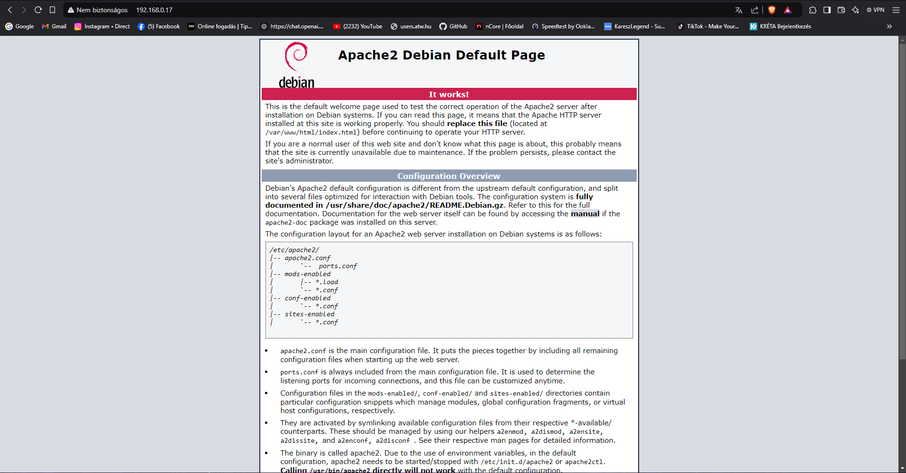

## Index.html átírás php-ra:
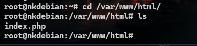

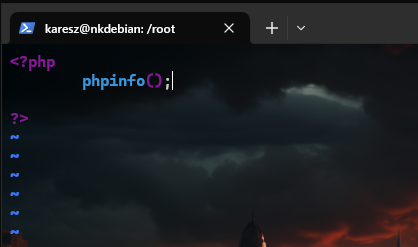

## Ez után a megszokott ip-vel megnézzük e hogy bedobja e az oldalt:

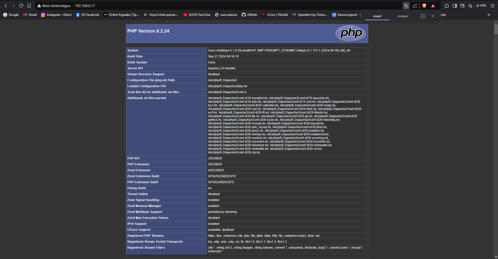

## Adatbázisok ellenőrzése:

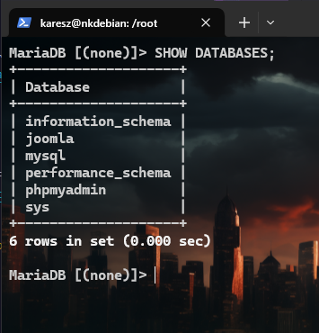

## PHPmyadmin oldal ellenőrzése:

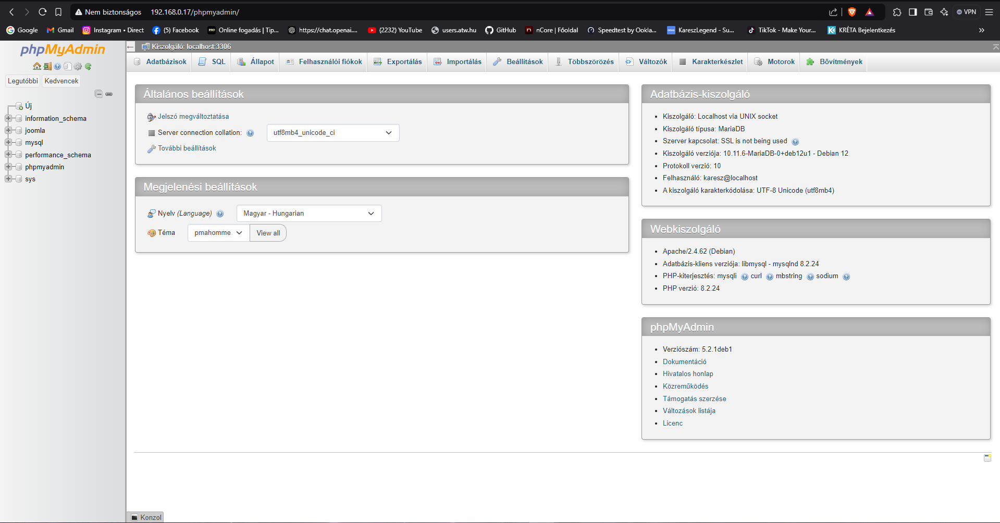

## Apache konfigurálása:

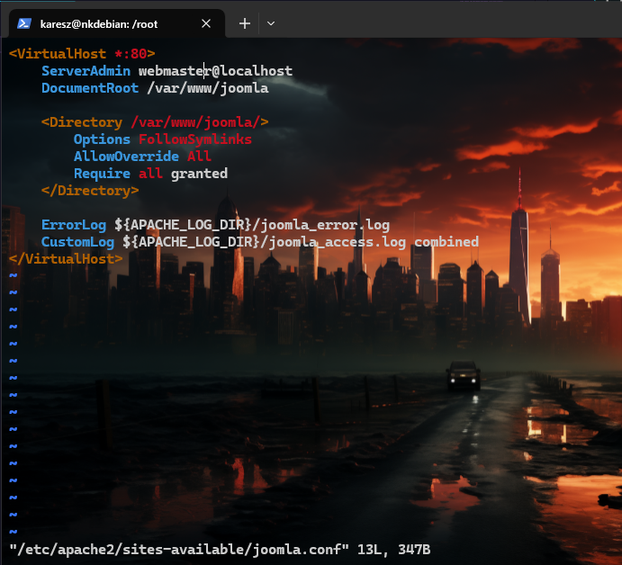

## Joomla beállítása és ellenőrzése:

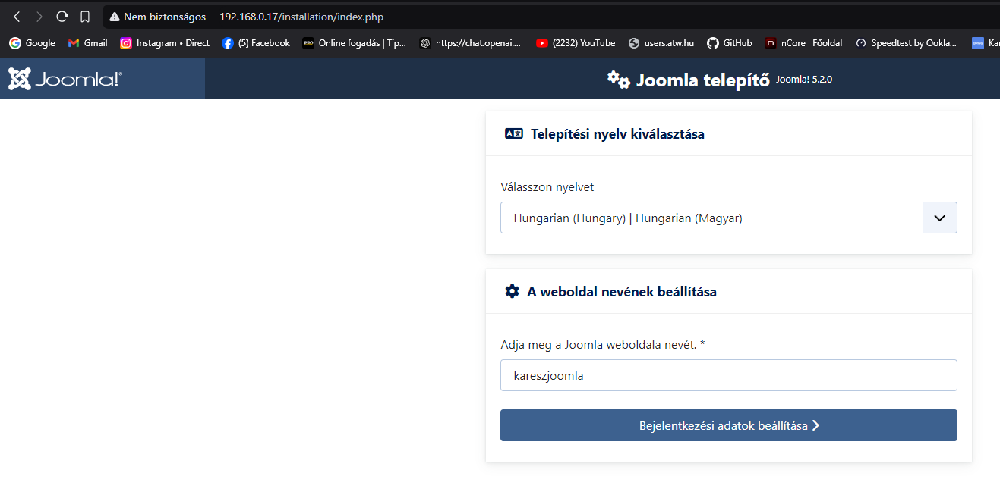

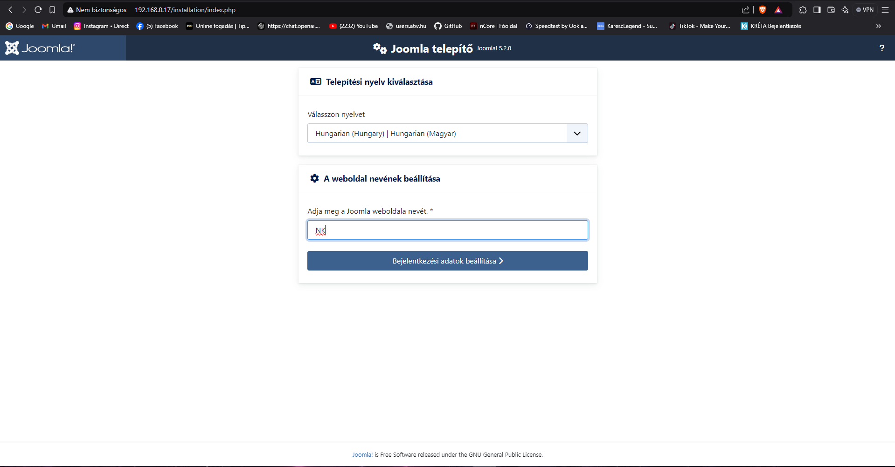

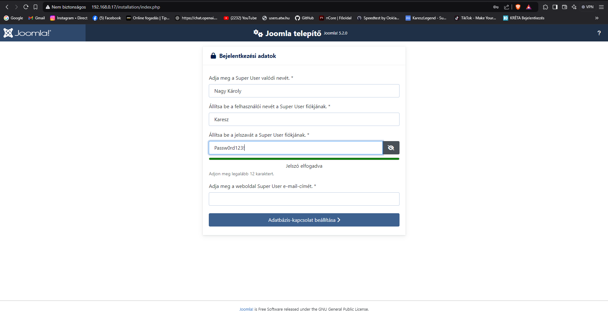

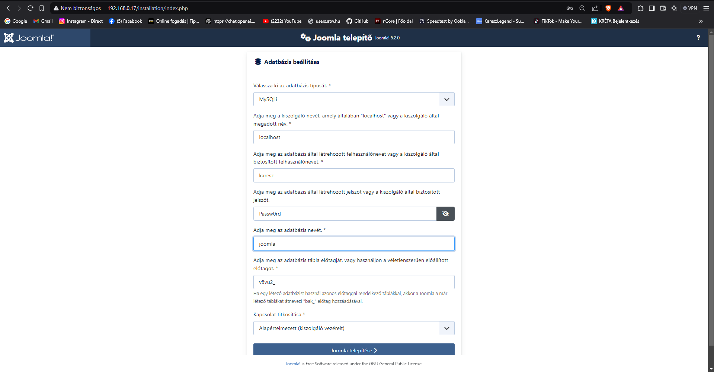

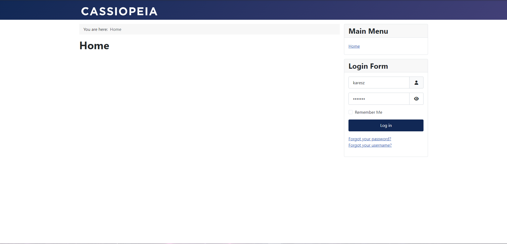

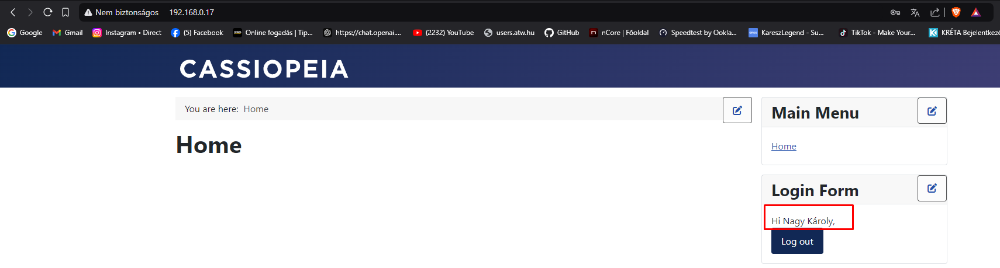

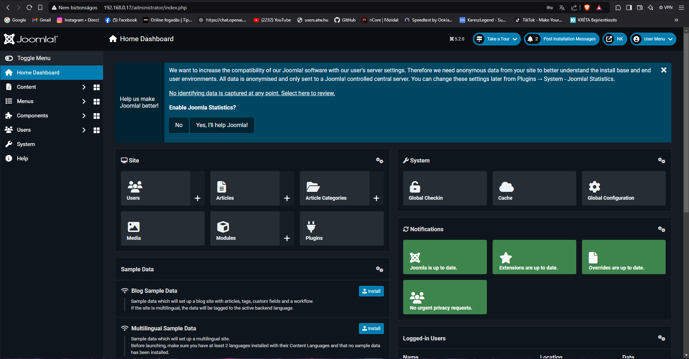

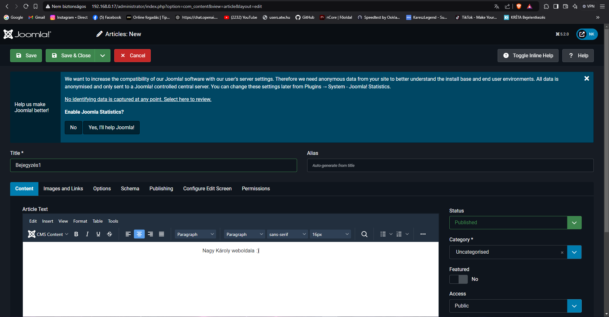

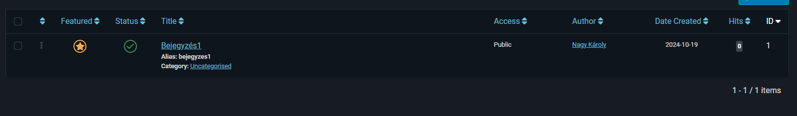

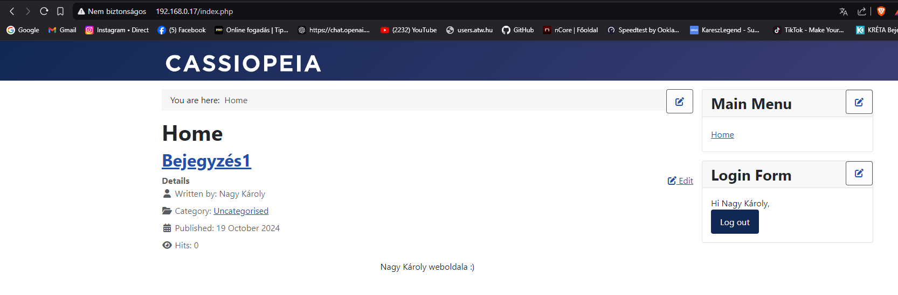

## Proftpd ellenőrzése:

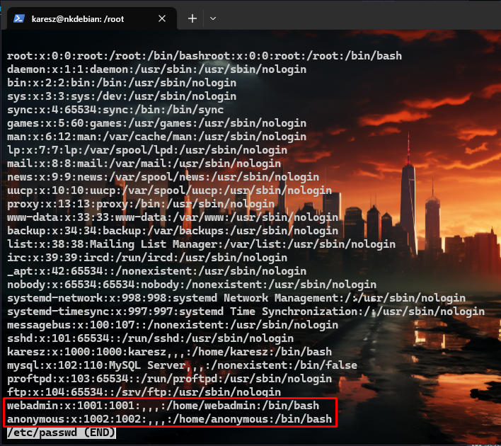

Az előző képen látható két pirossal bekeretezett felhasználóval be tudunk lépni **Filezillában**  
IP cím: **192.168.0.17**  
Felhasználónév: **webadmin,anonymous**  
jelszó:**Passw0rd**  
Port:**Ebben az esetben hagyjuk üresen, mert nem állítottunk be külön portot.**  

## Ha jól működnek a dolgok így kell mutassa a filzeilla a fájlokat

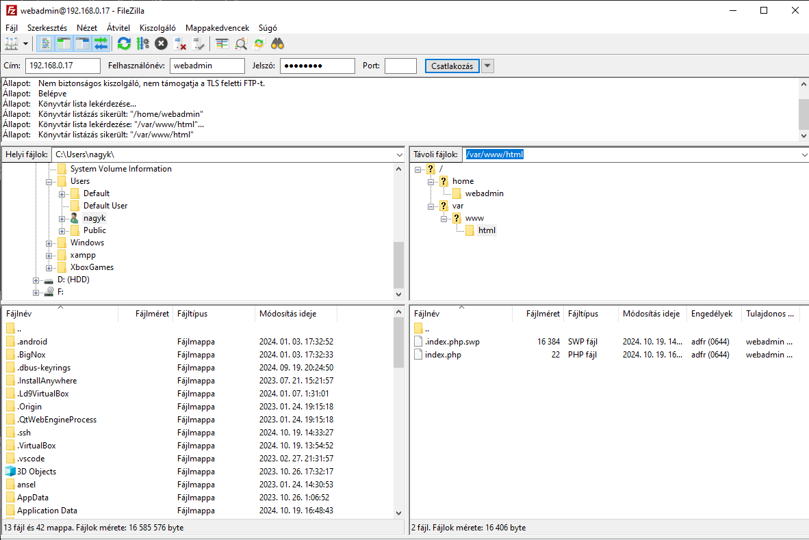

# Vége
<hr>